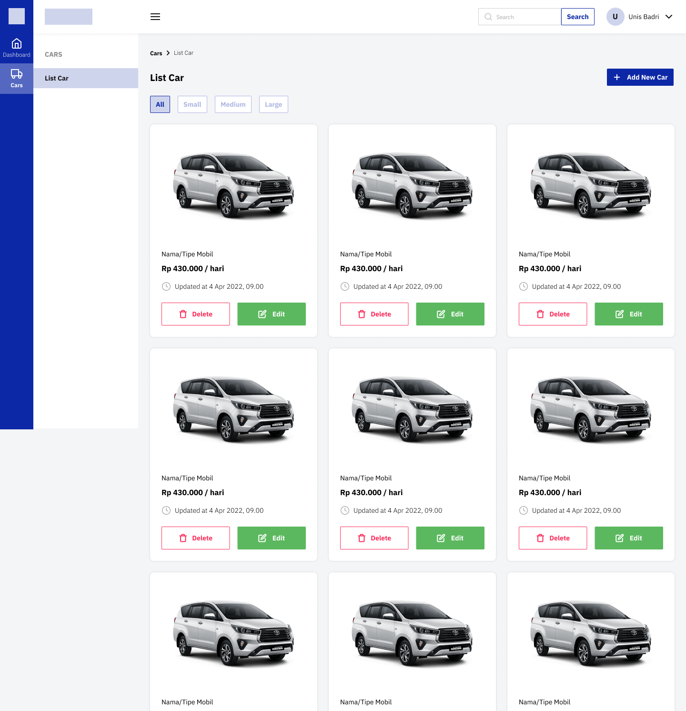

<h1 align="center">
  <br>
  
  <br>
  <br>
  Challange 4 Binar Car Management Dashboard
  <br>
</h1>

<h4 align="center">A Fullstack Dashboard for Binar Academy designed to manage car data and a car rental website utilizing <a href="https://expressjs.com/" target="_blank">Express.js</a> as the backend and <span style="color:red;">Postgress</span> as the Database Management System (DBMS)</h4>

<p align="center">
  <a href="#express">express</a> •
  <a href="#postman">postman</a> •
  <a href="#sequelize">sequelize</a> •
  <a href="#javascript">javascript</a> •
  <a href="#nodejs">nodejs</a> •
  <a href="#postgress">postgress</a> •
  <a href="#json">json</a>
</p>



## Data Diri

### KM x Binar Academy Batch 6

|                |                      |
| -------------- | -------------------- |
| Nama Peserta   | Muhammad Rizki       |
| Kelas          | FSW 1                |
| Fasilitator    | Imam Taufiq Hermawan |
| ID Fasilitator | F-FSW24001086        |
|                |                      |

## Project

Membuat Dashboard Admin Cars Binar Academy X Kampus Merdeka Batch 6

### Setup

#### 1. Node.js

Install seluruh package yang ada pada package.json dengan perintah seperti berikut:

```
npm install
```

#### 2. Download Requirement

Install Postgress dan juga PGAdmin(Optional Yang penting DBMS)
[pgAdmin](https://www.pgadmin.org/download/) | [PostgreSQL Server](https://www.postgresql.org/download/)

#### 3. Setup Database

Agar dapat berjalan perlu menambahkan data pada .env untuk bisa connect ke database, contoh isi dari .env bisa dilihat pada .env-example

```
PORT=
DB_USERNAME=
DB_PASSWORD=
DB_NAME=
DB_HOST=
DB_PORT=
```

#### 4. Menjalankan server

Untuk menjalankan server, dapat digunakan perintah berikut:

```
npm run dev
```

Untuk melihat antarmuka, dapat menggunakan link berikut:

```
http://localhost:3000
```

## Table Diagram

<h1 align="center">
  
</h1>

## Feature

### 1. Import Data Car Seeder

```
npm run import-data
```

### 2. Clear Data Car

```
npm run clear-data
```

## API Routes

### 1. Root Endpoint (GET)

```http
  /api/v1
```

### 2. Get All Car (GET)

```http
  api/v1/cars
```

### 3. Get Car By ID (GET)

```http
  api/v1/cars/:id
```

### 4. Create Car (POST)

```http
  api/v1/cars
```

### 5. Update Car (PATCH)

```http
  api/v1/cars/:id
```

### 6. Delete Car (DELETE)

```http
  api/v1/cars/:id
```

## Web Page

| Endpoint       | Deskripsi                  | Example                                   |
| -------------- | -------------------------- | ----------------------------------------- |
| /              | Homepage                   | http://localhost:3000/                    |
| /client        | Search Car Page Client     | http://localhost:3000/client              |
| /cars          | Admin Dashboard Page       | http://localhost:3000/cars                |
| /cars/create   | Admin Creat New Data Page  | http://localhost:3000/cars/admin/create   |
| /cars/edit/:id | Admin Edit Data Page By ID | http://localhost:3000/cars/admin/edit/:id |

| Challange                                     |
| --------------------------------------------- |
| F-FSW24001086-km6-riz-Dashboard-ch4           |
| [GOLD🥇] Chapter 4 - Car Management Dashboard |
